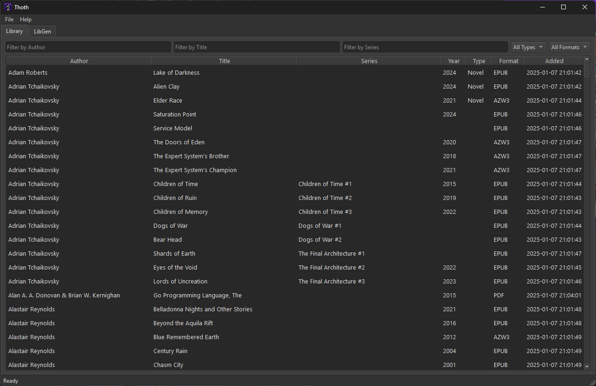

# Thoth

    

Ebook library manager and LibGen client.

## Features

TODO

## Installation

Thoth uses the [Calibre](https://calibre-ebook.com/) CLI tools to update metadata and convert ebooks. Make sure you have Calibre installed first.

### Windows

Download the latest release from the [releases page](https://github.com/kkestell/thoth/releases) and run the installer. Thoth will be installed to `%LOCALAPPDATA%\Programs\Thoth` and a shortcut will (optionally) be created on the desktop.

### macOS

TODO

### Linux

TODO

## Screenshots

